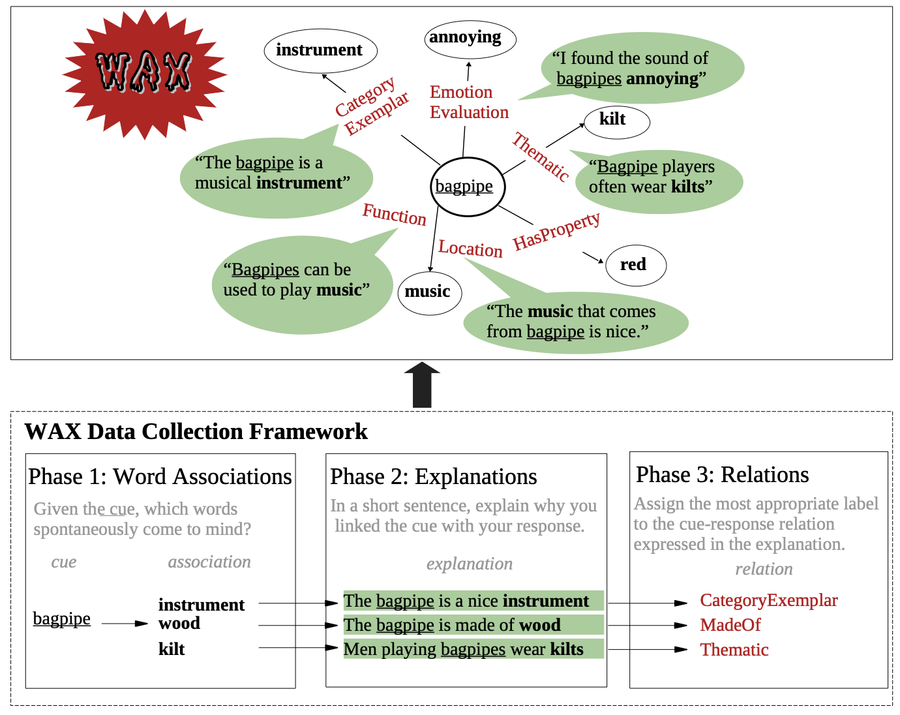
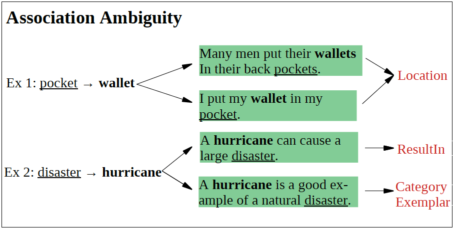
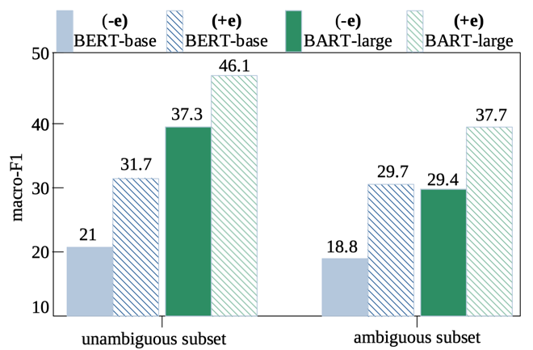
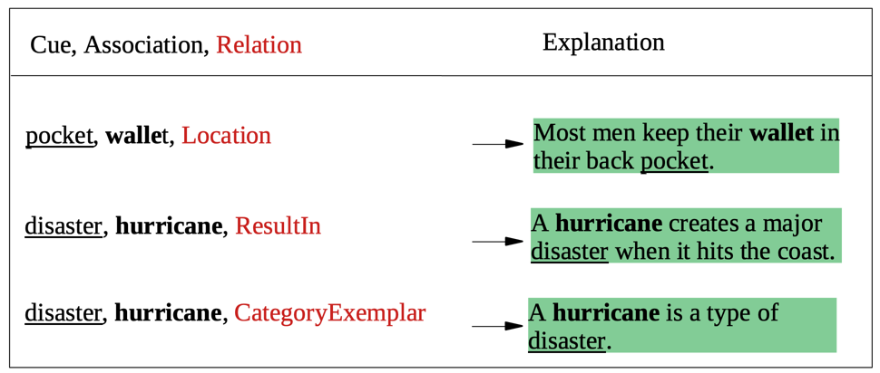

# WAX

This repository contains human association explanation for the [WAX](WAX__A_novel_dataset_for_Word_Association_eXplanations.pdf) dataset. We present the dataset and the baselines for probing to what extent current pre-trained language models capture the underlying relations in human associations. 


**Links**: 
[paper](paper/WAX__A_novel_dataset_for_Word_Association_eXplanations.pdf)
[dataset](WAX.csv)
[poster](paper/AACL_WAX_Poster_73.pdf)


## Introduction 
Word associations are among the most common paradigms for studying the  human mental lexicon. While their structure and types of associations have been well studied, surprisingly little attention has been given to the question of *why* participants produce the observed associations.

We introduce a large, crowd-sourced dataset of English word associations with explanations, labeled with high-level relation types. An example from WAX is shown in Figure 1 (top), bagpipe and kilt is associated is because *"Bagpipe players often wear kilts."* , which is labelled with a Thematic relation label. The framework for collecting WAX is shown on the bottom of Figure 1. 
<!--  -->
<p align = "center">

</p>
<p align = "center" style="font-family:liberation sans">
Figure 1: An example of bagpipe from WAX and the collection framework. 
</p>

WAX consists of 1.1K cues with 1.9K explanations. A subset (1.5K) of the explanations are labelled with one of 16 association relations (e.g., Function, HasProperty). 

### Key Challenges 
Word association understanding is challenge is because:

(1) The underlying association reasons are often diverse and unknown.
<!-- Some examples
* clear,glass,the glass in my window is clear.
* comedy, laughter, when you watch a comedy you have a lot of laughter.
* creak,wood,the wood started to creak as people stepped on it 
* mixed,drinks,drinks are often mixed with multiple different fluids.
* mixed,bag,the movie was a mixed bag. --> 
(2) the uncertainty of single or multiple relations existing in the association reasons/explanations. For example, pocket and wallet are consistently associated with a single reason (Location), while hurricane and disaster are associated with different relations (ResultIn and CategoryExemplar).



**WAX** allows us to study whether two words are consistently associated with the same relation type (relation unambiguous; Ex1) or with different relation types (relation ambiguous; Ex 2) via labelling human explanations with high-level relations. 

# Repository Structure

## **WAX Dataset** 
### Full WAX
You can download the full WAX dataset from [WAX.csv](WAX.csv), which includes 4 columns:
* cue: the cue concept/words that we used to stimulate people. 
* association: the association collected from workers. 
* explanation: the explanations generated by workers who generate the association.
* relation: the relation label for explanations. The value in this column is either (1) one of the 16 relation labels for explanations, which are the majority label from five annotators; (2) or **UNK**, which means that the relations of explanations are unlabelled. 

### Additional data
You can get access to the following additional data under the [dataset](./dataset) folder: 
* [wax_human_auto_labelled.csv](./dataset/wax_human_auto_labelled.csv): the 1.5K relation labelled subset in **WAX**, including 725 instances from crowd-sourced and 836 instances labelled automatically with human verification. 
  
* [wax_human_labelled.csv](./dataset/wax_human_labelled.csv): the final relation labelled subset from crowd sourcing. The label is the majority votes from five workers. Detailed labels of all five workers are provided in [wax_human_labelled_all_workers.csv](wax_human_labelled_all_workers.csv).


* [test_wax_ambiguous.csv](./dataset/test_wax_ambiguous.csv): the relation ambiguous subset, in which each (cue, association) pair is labelled with multiple relations.
* [test_wax_unambiguous.csv](./dataset/test_wax_unambiguous.csv): the relation unambiguous subset, in which each (cue, association) pair is consistently labelled as a single relation. 


## **Relation Classification**
The [relation_classification](./relation_classifiation/) folder contains the data and code for the  task of relation classification.
To assess to what extent can pre-train language models classify the word association relation with and without explanations, we employ BERT and BART to predict the mostly likely relation given: 
*  a (cue, association) pair (**-e**)
*  a (cue, association, explanation) tuple (**+e**)

To assess to what extent models can label the relation ambiguity between words, we split our labelled subset into two test scenarios: 
* unambiguous subset: a (cue, association) pair are consistently associated with one relation label.
* ambiguous subset: a (cue, association) pair are labelled with multiple relation labels. 

The experimental results are shown as follows: 



We observed that: (1) access to explanations improve model performance and (2) the ambiguous subset is harder to predict. 

## **Explanation Generation**
The [explanation_generation](./explanation_generation/) folder contains the code for the task of generating explanations.
We fine-tuned BART on our data set to generate an explanation given a (cue, association, relation) triple. 
Some examples are shown as follows: 



# Misc

## Citations
```
@inproceedings{liu-etal-2022-wax,
    title = "{WAX}: A New Dataset for Word Association eXplanations",
    author = "Chunhua Liu  and
              Trevor Cohn  and
              Simon De Deyne and
              Lea Frermann",
    booktitle = "AACL-IJCNLP ",
    month = nov,
    year = "2022",
    address = "Online",
    publisher = "Association for Computational Linguistics",
}
```

## Contact

Feel free to contact chunhua[dot]liu[at]student.unimelb.edu.au if you have any feedback.